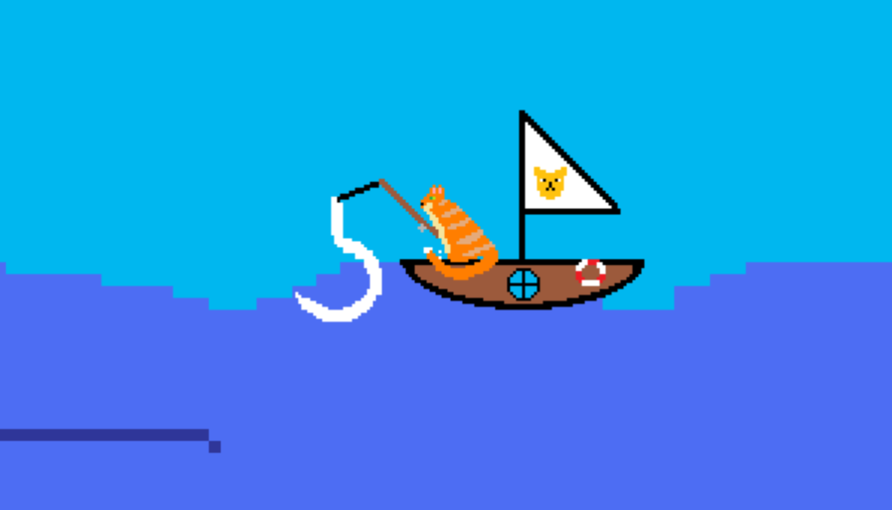
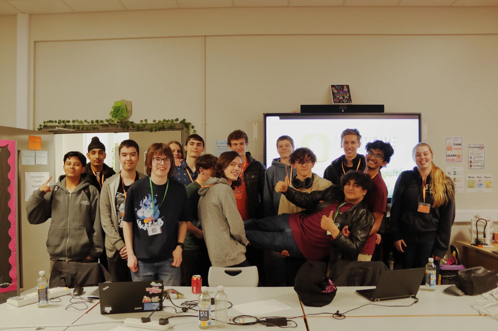

As leader of ComSoc at my school, I guide the Year 12 and 13 students and keep on the lookout for any new opportunities we can take part in.

A few months ago, we practiced for the [British Informatics Olympiad,](https://olympiad.org.uk/) a challenging set of three questions that required us to design accurate algorithms to solve. Over a short period, I had helped transform a group of enthusiastic Year 12 students into confident programmers capable of breaking down and solving complex problems.

Whilst looking for new events, I found [Campfire,](https://campfire.hackclub.com/) a team-based hackathon by Hack Club, where over the span of 12 hours, you design, create, and present a game, and the best teams receive prizes! Having previously competed in [Daydream](https://daydream.hackclub.com/) - a very similar game jam - I knew that this would be a lot of fun. After getting the members of ComSoc to split into teams and sign up, we were off to the races.

## Preparing for Campfire

Nowadays, there's plenty of choice for how to produce and release a game. The event was restricted to only game engines that could be exported to run on the web. After some thought, I chose to use [Godot](https://godotengine.org/) as its beginner-friendly nature makes it the perfect candidate for teaching.

The members of my society needed some teaching, so after struggling through the pain that is Git credentials on Windows, I had them all set up and installed with the necessary software. After I ran a session on creating a simple platformer to bring them up to speed, I knew they were ready.

## The Big Day

On the car journey over, I learned that the surprise theme was "Beneath the Surface", which started to give me plenty of ideas.

Once we all arrived at the location, I met up with my teammates. It took a little brainstorming, but we came up with the idea for our game. Inspired by the incremental games you often see in ads or see others playing, our game was to be based around a cat that goes fishing deeper and deeper into the ocean. Any caught fish could be sold to buy upgrades, allowing for even deeper levels to be reached. We named it "Cat-Fishing Frenzy".

## Developing the Game



We began the event by first creating the assets we would need. I used [Aseprite](https://www.aseprite.org/) to design the pixel art for many of the fish that would swim in the sea.

Next, we laid the foundations. The main scene was created and populated with the cat, rod, and boat. After adding the fishhook, Ryley discovered a neat way to create the fishing line by just moving a point on a Godot Line2D.

```gdscript
func _process(_delta: float) -> void:
	set_point_position(1, to_local(node.global_position))
```

Ryley and I worked on fish spawning, whilst Sam implemented a currency and shop system. With each of us working on largely different areas of the codebase, Git merge conflicts were easy to solve and very infrequent.

After not too long, we had created the skeleton of a fully functional game! With plenty of time to spare, we introduced a couple of smaller mechanics, and the game received many balancing tweaks. After some polishing, the time was up, just in time for the pizza that the organisers ordered.

We presented the game to the other competitors, and then came a voting round. After a suspenseful wait, the results were in, with [our game taking first place!](https://refractfoundation.org/events/campfire)

## Retrospective



This hackathon was plenty of fun to attend, and winning it was the icing on top. Lots of nice prizes were dished out, but I really enjoyed getting to know the people I was working with better. Programming under strict time constraints was excellent practice for my efficiency and teamwork skills, and I look forward to further opportunities in the future.

If you're curious, you can play [Cat-Fishing Frenzy](https://ethanhawksley.itch.io/cat-fishing-frenzy) here on itch.io. You'll need the arrow keys to move the hook, so no mobile compatibility at the time of writing.
